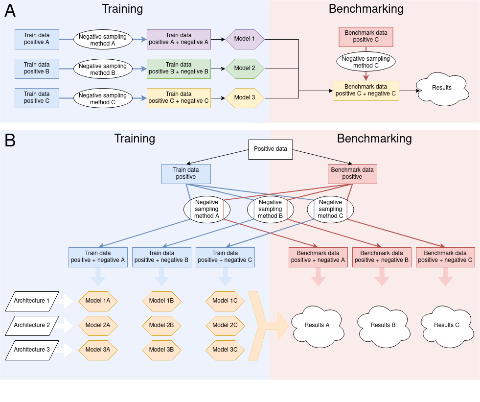
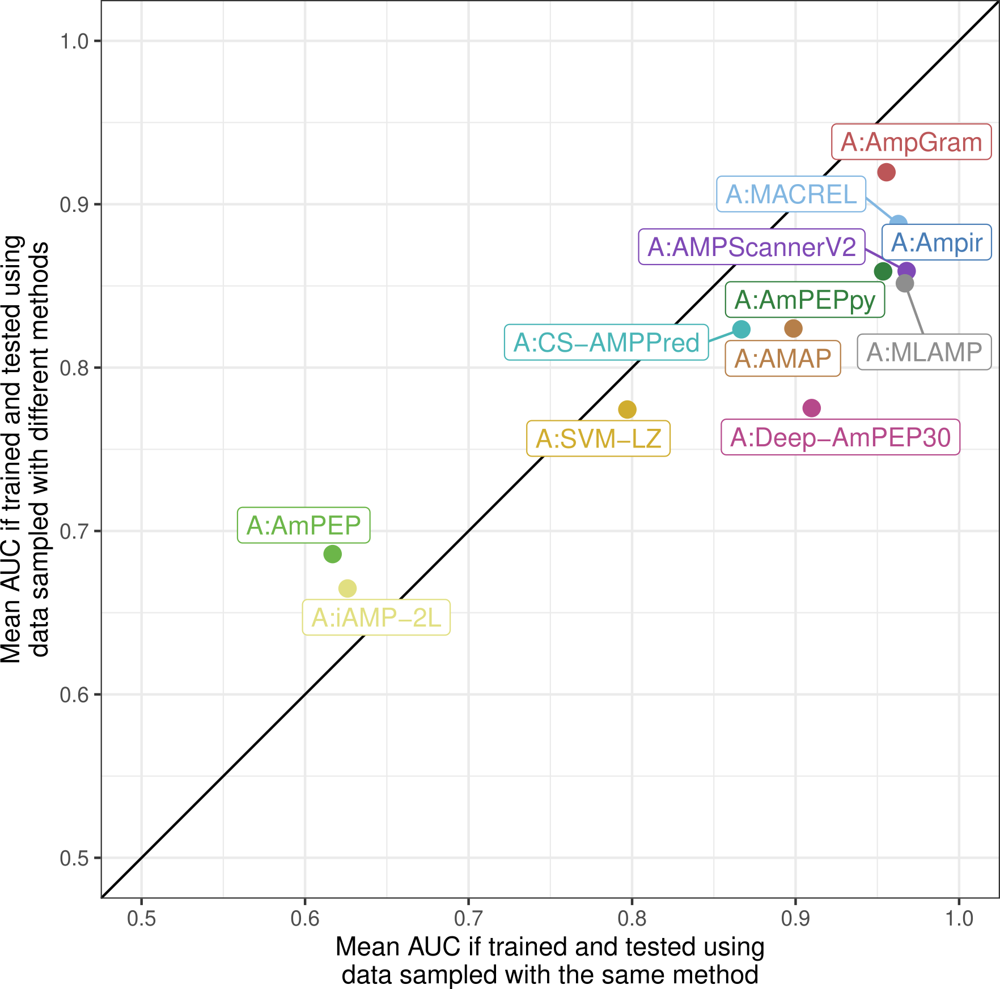

---
title: Benchmarks in antimicrobial peptide prediction are biased due to the selection of negative data
output:                                                                                                         
  html_document:
    toc: true
    toc_float:
      toc_collapsed: false
    toc_depth: 3
    number_sections: false                                                                                                
    css: lux.css                                                                                               
---      

# What's wrong with prediction of antimicrobial peptides?

1. To build a model for predicting antimicrobial peptides (AMPs), you usually sample negative data.
2. Models trained and evaluated using negative data sampled similarly perform better.
3. Thus, if you compare your model with others using only your data as a benchmark, the performance of models trained on other types of negative data will be biased.

It means that if you have proposed a novel model, you should at least train it and evaluate its performance using precisely the same method of sampling data (or, even better, the same data) as other tools. However, the best to do this is to train several iterations of your model using different datasets available in our benchmarking tool, AMPBenchmark (http://biogenies.info/AMPBenchmark/).

# Why is that?

In our study, we investigated the impact of negative data sampling on model performance and benchmarking. We decided to explore this issue because each developer of an AMP predictor tested only one sampling method to build the optimal non-AMP class despite knowing that machine learning models heavily depend on the data sets they are trained on. They all overlooked that various sampling methods could generate statistically different samples, affecting their models' predictive power. Moreover, we investigated how machine learning architectures perform when trained on a given data set but tested on a different one, a standard model benchmarking (part A of the figure below). This particular issue is of vital importance not only for the comparison of AMP predictors but for the evaluation of all machine learning models in general. We define the machine learning architecture as an approach to solving the problem of AMP prediction with all its parameters involved in the machine learning cycle. The architectures for our study are based on published models that we were able to reuse or reimplement; some might slightly deviate from the original methods. By the machine learning model, we understand one specific instance of a given architecture, i.e. an architecture trained on the same positive and one of negative samples. Consequently, we generated 660 machine learning models using (i) 12 defined architectures, (ii) the same positive training data set and (iii) 11 different negative sampling methods, each run five times (part B of the figure below). To our knowledge, this was the first kind of such a research project undertaken, and moreover, on such a scale.

The main conclusion from our analyses is that similar training and benchmark data set positively affect model performance. All but two architectures performed much better when the training and benchmark samples were generated by the same sampling method (see the figure below). Accordingly, there was significant negative correlation between mean AUC value and the difference in amino acid composition between the training and benchmark sets. The AUC values calculated were the highest for sampling methods that produced data sets similar in terms of length distribution, amino acid composition and physicochemical properties.

Our study represents the first unbiased approach to compare models for AMP prediction, and moreover, we made reproducible another six model architectures for further research. In total, we built a staggering number of 660 machine learning models from 12 architectures. Therefore, being fully aware of the difficulty of the task, we highly recommend all researchers to embrace the notion of fair benchmarking and reproducibility by using AMPBenchmark web server.

Read more in our pre-print: https://doi.org/10.1101/2022.05.30.493946.
 
# AMPBenchmark

[AMPBenchmark](http://biogenies.info/AMPBenchmark/) is a part of our initative for the improvement of benchmarking standards in the field of antimicrobial peptide (AMP) prediction. It allows researchers to compare their newly developed model for prediction of AMPs with others considered in our study. 
We provide training data sets generated using 11 negative sampling methods in five replications and corresponding benchmark data sets. For a fair benchmark, a new model should be trained using each of the training data set and benchmarked against our data using a subset of sequences for appropriate replication. Obtained results may be submitted to the [AMPBenchmark web server](http://biogenies.info/AMPBenchmark/) to compare a new model with models investigated in our study.

For more detailed instruction click [here](https://github.com/BioGenies/AMPBenchmark#how-to-use-the-public-data).

# Citation

Katarzyna Sidorczuk, Przemysław Gagat, Filip Pietluch, Jakub Kała, Dominik Rafacz, Laura Bąkała, Jadwiga Słowik, Rafał Kolenda, Stefan Rödiger, Legana C H W Fingerhut, Ira R Cooke, Paweł Mackiewicz, Michał Burdukiewicz [*Benchmarks in antimicrobial peptide prediction are biased due to the selection of negative data.*](https://doi.org/10.1101/2022.05.30.493946)

# Important links

 - https://github.com/BioGenies/NegativeDatasets: the repository containing the code necessary to reproduce results of our analysis.
 - https://github.com/BioGenies/NegativeDatasetsArchitectures: the repository containing all architectures considered in our analysis.
 - https://github.com/BioGenies/AMPBenchmark: the source code of AMPBenchmark.
  
  
# Contact

If you have any questions, suggestions or comments, contact [Michal Burdukiewicz](mailto:michalburdukiewicz@gmail.com).
 
# Participants

 - [Katarzyna Sidorczuk](https://twitter.com/k_sidorczuk).
 - Przemysław Gagat.
 - Filip Pietluch.
 - Jakub Kała.
 - Dominik Rafacz.
 - Laura Bąkała.
 - Jadwiga Słowik.
 - [Rafał Kolenda](https://twitter.com/kolendarafal).
 - Stefan Rödiger.
 - Legana C H W Fingerhut.
 - Ira R Cooke.
 - Paweł Mackiewicz.
 - [Michał Burdukiewicz](https://github.com/michbur).

