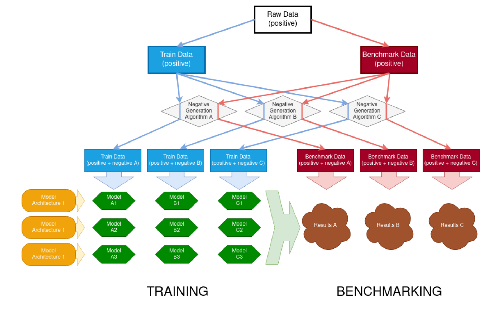

<link href="https://fonts.googleapis.com/css?family=Montserrat&display=swap" rel="stylesheet">

## Antimicrobial peptides

How to build a novel classifier of AMPs:

1. Download positive data (AMPs) from any AMP database,
2. Generate negative data,
3. Train a model,
4. Benchmark with others and win, 
5. Profit!
 
## Antimicrobial peptides

How to build a novel classifier of AMPs:

1. Download positive data (AMPs) from any AMP database,
2. **Generate negative data,**
3. Train a model,
4. Benchmark with others and win, 
5. Profit!

## Generation of negative data

There are many competitive algorithms for generation of negative datasets.

General scheme:

1. Download specific sequences from UniProt (e.g., non-microbial).
2. Select some of them of their parts.

## Scientific question

Are these different algorithms for generation of negative datasets equal? Can we expect that models (the same architecture) trained on different negative datasets be behave similarly?

## Data

 - 22 different architectures.
 - 13 algorithms for generation of negative datasets.
 
Model is a combination of an architecture and an algorithm for generation of negative datasets.
 
## Research plan

## Scientific questions

 - how to compare models (architecture-wise and algorithm-wise)?
 - how to measure the impact of architectures and algorithms?
 
## Acknowledgements

 - Katarzyna Sidorczuk
 - Przemysław Gagat
 - Dominik Rafacz
 - Mateusz Bąkała
 - Filip Pietluch
 - Jakub Kała
 - Jadwiga Słowik
 